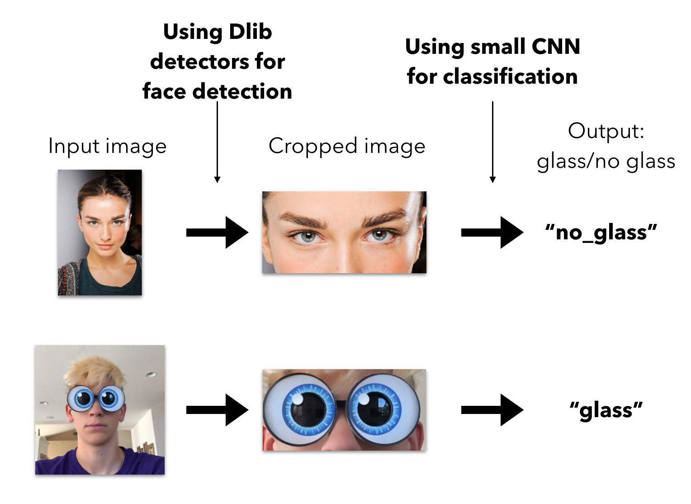

# aifactory_test_dl_task

### классификатор изображений с лицом человека, разделяющий их на людей в очках, надетых на глаза и всех остальных

Краткое пояснение решения

### Обучение

Файл с обучением находится в `research_and_train_nn/research.ipynb`

#### Датасет
Был взят датасет https://github.com/cleardusk/MeGlass c 40k фотографиями людей. Для каждой фотографии из датасета мы знаем, в очках человек или нет. Но, внимательно изучив датасет и данные, которые мне предоставила aifactory, я понял, что одного такого датасета недостаточно. Также, я напарсил около 500 фотографий по запросам "snapchat glasses", "funny glasses" и т.п. через библиотеку https://github.com/hardikvasa/google-images-download , таким образом был сформирован датасет для обучения модели

#### Модель
C моделью я особо не заморачивался: основное нужно было сделать быстрый инференс и ограничить вес модели 3Mb, поэтому я отказался от больщих Dense слоев, а типичный Flatten заменил на GlobalAveragePooling

Описание модели изображено на рисунке:

#### Аугментации

Я использовал много разных сильных аугментация при помощи библиотеки https://github.com/albu/albumentations

#### Обучение

Обучал, постепенно понижая lr, увеличивая жесткость аугментаций

#### Оценка модели

**По скорости работы:**

**По точности:**

acc на валидации (валидировался я на предоставленном тестовом сете картинок) составила **0.95**

### Запуск

Все нужные для работы системы зависимости прописаны в `requirements.txt`

Для запуска, предоставляется:

* скрипт `./deploy/run_on_folder.py`, запуск: `python3 ./deploy/run_on_folder.py path/to/folder`, который выведет какие фотографии людей с очками есть в данной папке

* coreml transormer, который переводит модель в core-ml формат, предназначенный для работы на мобильном устройсте

* REST - сервис, который по запросу `curl -F "image=@path/to/local/image.jpg" http://server_host:8888/glass_no_glass/` выдаст ответ вида `{"answer": "no_glass"}`. Запуск: "python3 deploy/rest_server/server.py"
